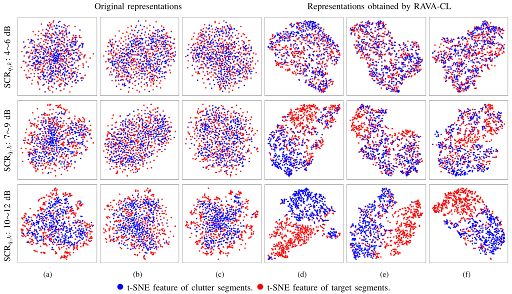

# RAVA-CL
This repository is the PyTorch implementation for the paper:
> **Senlin Xia**, Yukai Kong, Kui Xiong, and Guolong Cui, 
> ``Target detection in sea clutter via contrastive learning,''
> *IEEE Transactions on Instrumentation and Measurement*, 2023. [[paper](https://ieeexplore.ieee.org/document/10168724)]

 
  

Contact: [xiasenlin0810@gmail.com](mailto:xiasenlin0810@gmail.com)

## Citation
    @article{xia2023target,
    title={Target Detection in Sea Clutter via Contrastive Learning},
    author={Xia, Senlin and Kong, Yukai and Xiong, Kui and Cui, Guolong},
    journal={IEEE Transactions on Instrumentation and Measurement},
    year={2023},
    volume={},
    number={},
    pages={1-1},
    doi={10.1109/TIM.2023.3288254}
    }
